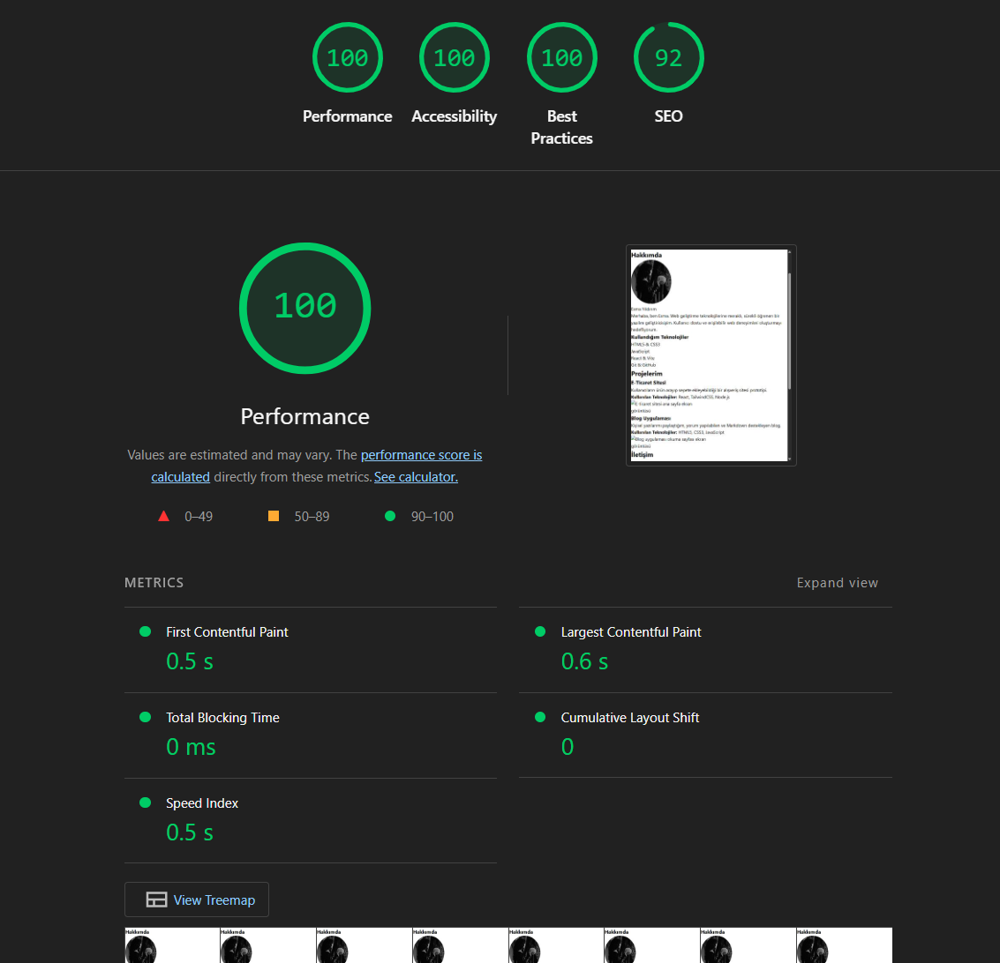
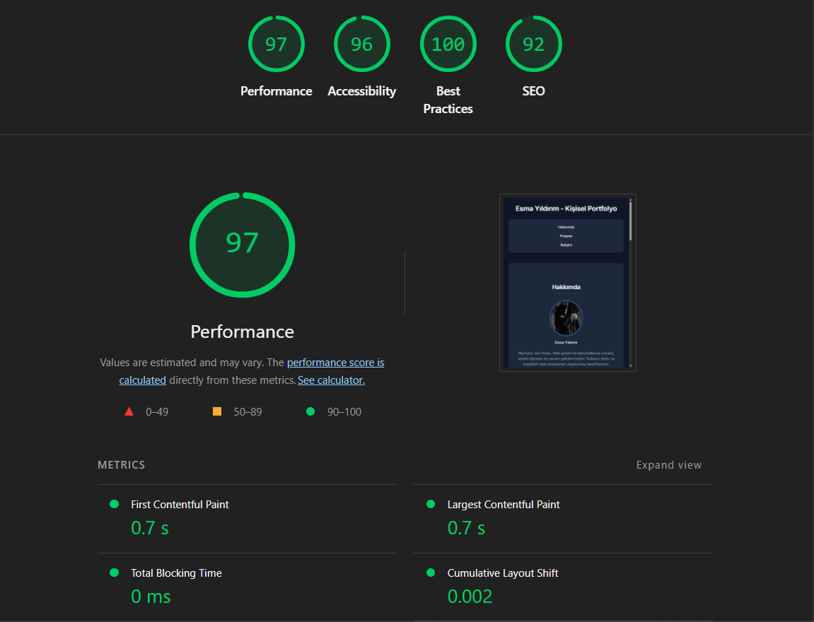

# Kişisel Portfolyo

Bu proje, kişisel portfolyo sayfasının modern, karanlık (dark) tema ve yüksek erişilebilirlik standartlarına uygun olarak yeniden tasarlanmasını içermektedir.

## Özellikler

- **Modern Karanlık Tema (Dark Mode):** CSS değişkenleri ve modern `flexbox`/`grid` modülleri kullanılarak oluşturulmuş, kullanıcı dostu renk paletine (slate ve blue tonları) sahip arayüz tasarımı.
- **Erişilebilirlik (Accessibility - a11y):** Klavyeyle gezinmeyi kolaylaştıran "Ana içeriğe atla" (Skip Navigation) bağlantısı, görünür odak (focus) göstergeleri, anlamsal (semantic) HTML etiketleri ve ARIA nitelikleri sayesinde tüm kullanıcı gruplarının sayfayı rahatça kullanabilmesi sağlandı.
- **Duyarlı Tasarım (Responsive Design):** Mobil ekranlardan geniş masaüstü monitörlere kadar her boyuttaki cihazda sorunsuz bir deneyim sağlamak amacıyla esnek tasarıma uyarlanmıştır.
- **Performans:** Minimal CSS ve standart HTML kullanılarak yüksek performans hedeflendi.

## Sonuçlar (Lighthouse Raporları)

Projede yapılan kullanıcı arayüzü ve performans/erişilebilirlik iyileştirmelerinin etkisini ölçmek amacıyla Lighthouse raporları oluşturulmuştur. Tasarım değişikliğinden önceki durum ile son performans optimizasyonlarını içeren rapor görselleri aşağıdadır.

### CSS Düzenlemesinden Önce
*(Eski sürümdeki sayfa durumu ve Lighthouse metrikleri)*

### CSS Düzenlemesinden Sonra
*(Yeni modern karanlık tema uygulaması ve optimizasyonlardan sonraki metrikler)*

